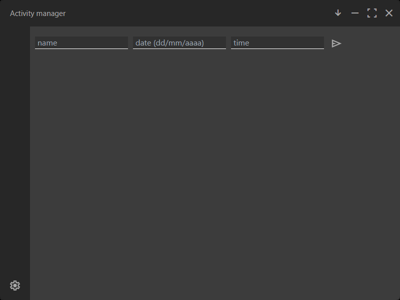
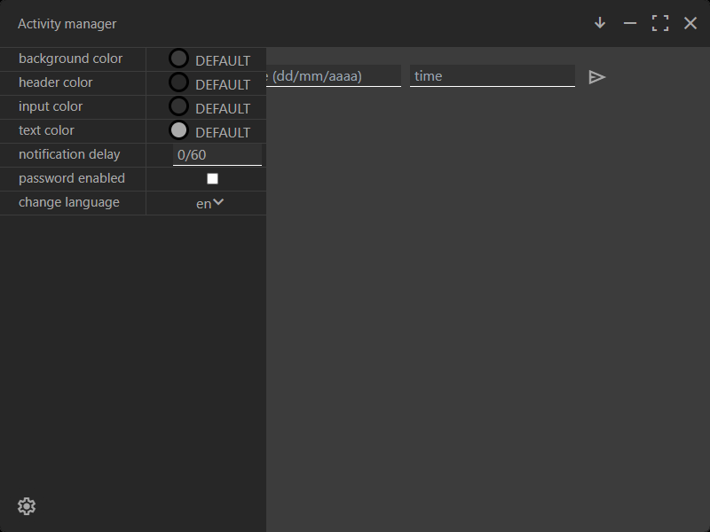

# ABOUT

This is an application that lets you store appointments using a name, a date and a time and then reminds you 60 minutes before by default. It is fully customizable from the color of the inputs to the notification delay, it even lets you save a password to protect your privacy.\
This app comes in three languages that you can select from the settings: italian, english and french.\
The arrow button in the top right is used to put the app in the tray.

\
**landing page:**



\
**settings page:**



# BUILDING

installing dependencies

```bash
cargo install --path .
```

you also need tauri cli which you can install using:

```bash
cargo install tauri-cli
```

build using this in the root directory:

```bash
cargo tauri build
```
this generates the installers in target/release (for windows in bundles).\
you can use this command for developing:
```bash
cargo tauri dev
```

# INSTALLING

you can run the generated installers to install the app, otherwise you can download them from the [github release](https://github.com/ALUBER1/activity-manager/releases)